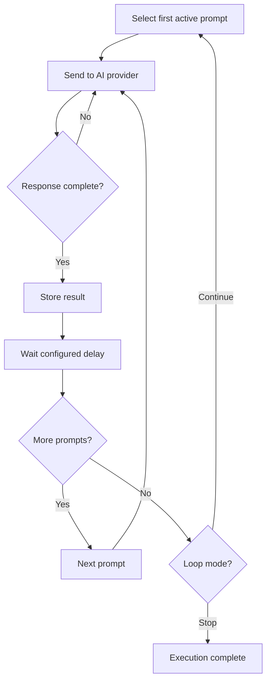
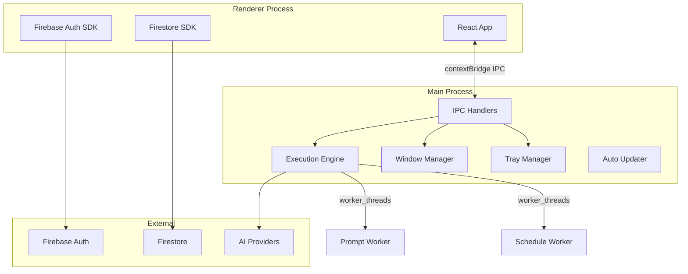
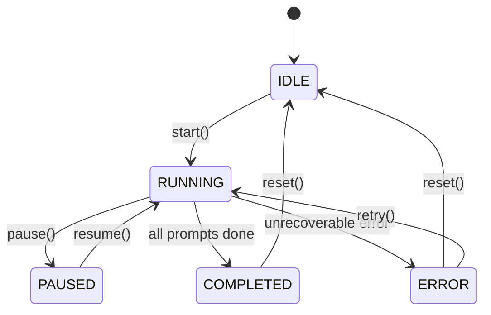

# Product Requirements Document (PRD)

**Product:** AI Prompt Queue Manager
**Working Title:** PromptLoop
**Status:** Draft
**Version:** 2.0
**Last Updated:** 2026-05-17

---

## Table of Contents

- [1. Product Overview](#1-product-overview)
- [2. Problem Statement](#2-problem-statement)
- [3. Goals](#3-goals)
- [4. Non-Goals (V1)](#4-non-goals-v1)
- [5. Target Users](#5-target-users)
- [6. User Stories](#6-user-stories)
- [7. Functional Requirements](#7-functional-requirements)
- [8. Advanced Features (Post-V1)](#8-advanced-features-post-v1)
- [9. UX Requirements](#9-ux-requirements)
- [10. Technical Requirements](#10-technical-requirements)
- [11. Data Model](#11-data-model)
- [12. Electron IPC API](#12-electron-ipc-api)
- [13. Success Metrics](#13-success-metrics)
- [14. Risks & Challenges](#14-risks--challenges)
- [15. Security Considerations](#15-security-considerations)
- [16. Error Handling & Edge Cases](#16-error-handling--edge-cases)
- [17. Future Vision](#17-future-vision)
- [18. Recommended MVP Scope](#18-recommended-mvp-scope)
- [19. Suggested Development Phases](#19-suggested-development-phases)
- [20. Example Workflow](#20-example-workflow)
- [21. Recommendation](#21-recommendation)

---

## 1. Product Overview

### Product Name
PromptLoop (working title)

### Product Summary
PromptLoop is a lightweight desktop application that allows users to create, organize, and automate a sequence of AI prompts. The app sends prompts one at a time to a connected AI agent, waits for completion, then automatically proceeds to the next prompt in the list. Once all prompts are completed, the system loops back to the beginning and continues indefinitely or based on configured rules.

The app is designed for:
- AI automation workflows
- Continuous content generation
- Iterative brainstorming
- Autonomous agent task execution
- Prompt experimentation
- Long-running AI processes

---

## 2. Problem Statement

Users currently manage repetitive AI prompt workflows manually:
- Copy/pasting prompts repeatedly
- Tracking execution order manually
- Re-running prompt cycles manually
- Losing execution history
- Difficulty automating iterative workflows

There is no simple "playlist-style" prompt automation tool focused on sequential AI execution with looping behavior — especially as a native desktop application that can run persistently in the background.

---

## 3. Goals

### Primary Goals
- Allow users to manage a queue/list of prompts
- Execute prompts sequentially
- Automatically continue to the next prompt after completion
- Loop continuously through all prompts
- Support multiple AI providers/agents
- Track execution history and responses
- Run as a persistent desktop app with tray/minimize support

### Secondary Goals
- Add scheduling and timing controls
- Add branching logic and conditions
- Support variables and templating
- Add analytics and monitoring
- System tray integration with quick controls

---

## 4. Non-Goals (V1)

The following are **not** included in V1:
- Multi-user collaboration / teams
- AI fine-tuning
- Complex workflow builders (visual node editors)
- Marketplace / community prompts
- Training datasets
- Agent memory systems (long-term)
- Voice support
- Mobile app version

---

## 5. Target Users

| User | Description |
|------|-------------|
| AI Power Users | Users running repetitive prompt workflows on their desktop |
| Developers | Developers testing prompts against AI agents locally |
| Content Creators | Users generating recurring content ideas or drafts |
| Researchers | Users performing iterative AI analysis tasks |

---

## 6. User Stories

### Prompt Management
- As a user, I want to create prompts
- As a user, I want to edit prompts
- As a user, I want to reorder prompts via drag-and-drop
- As a user, I want to enable/disable prompts
- As a user, I want to group prompts into workflows

### Execution
- As a user, I want prompts to execute sequentially
- As a user, I want the next prompt to wait until the previous one finishes
- As a user, I want workflows to loop automatically
- As a user, I want to pause/resume execution
- As a user, I want to stop execution at any time
- As a user, I want the app to keep running when I close the window (system tray)

### Monitoring
- As a user, I want to see the currently running prompt
- As a user, I want execution logs
- As a user, I want to see AI responses in real-time
- As a user, I want to retry failed prompts
- As a user, I want desktop notifications when workflows complete or fail

### Configuration
- As a user, I want delays between prompts
- As a user, I want configurable loop behavior
- As a user, I want API key management
- As a user, I want to choose which AI model to use

---

## 7. Functional Requirements

### 7.1 Authentication (Firebase Auth)

| Requirement | Priority |
|-------------|----------|
| Google OAuth login | High |
| GitHub OAuth login | High |
| Secure API key storage (local encrypted) | High |
| Session persistence across app restarts | High |
| Account deletion | Medium |
| Anonymous mode (local-only, no cloud sync) | Medium |

### 7.2 Prompt Management

#### Create Prompt

Fields:
| Field | Type | Required | Default | Description |
|-------|------|----------|---------|-------------|
| Title | string | Yes | - | Display name for the prompt |
| Prompt content | text | Yes | - | The prompt text sent to the AI |
| AI model | string | Yes | gpt-4 | Model identifier |
| Temperature | number | No | 0.7 | Model temperature (0.0-2.0) |
| Max tokens | number | No | 2048 | Maximum response tokens |
| Delay after execution | number | No | 0 | Delay in milliseconds before next prompt |
| Enabled/disabled | boolean | Yes | true | Whether prompt is active in workflow |

#### Prompt Ordering
- Drag-and-drop reordering
- Manual position number input

#### Prompt Groups / Workflows
- Create named workflow collections
- Run specific workflows independently
- Duplicate existing workflows
- Import/export prompts as JSON

### 7.3 Workflow Execution Engine

#### Sequential Execution Logic
```
1. Select first active prompt in workflow
2. Send prompt to configured AI provider
3. Wait for response completion (streaming or full)
4. Store response and metadata
5. Wait configured delay period
6. Move to next active prompt
7. Repeat steps 2-6
8. After last prompt, return to step 1 (loop)
```

#### Execution Flow Diagram


### 7.4 Looping System

| Mode | Description |
|------|-------------|
| Infinite Loop | Continuously repeats workflow forever |
| Fixed Iterations | Repeat for a configured number of cycles |
| Scheduled Window | Run only during specified hours/days |
| Single Pass | Execute once, no looping |

### 7.5 AI Provider Integration

#### V1 Providers
- OpenAI (GPT-4, GPT-4o, GPT-3.5-turbo)
- Anthropic (Claude 3 Opus, Sonnet, Haiku)
- Google (Gemini 1.5 Pro, Flash)

#### API Features
- Streaming responses (displayed in real-time in the execution viewer)
- Exponential backoff retry handling
- Rate limit detection and queuing
- Structured error handling per provider
- Configurable timeout per request
- Token usage tracking per call

### 7.6 Execution Monitoring

#### Dashboard
Display:
- Currently running prompt with real-time response
- Queue position and progress bar
- Total completed runs per session
- Failed runs and retry status
- Average response time (rolling window)
- Current workflow status (IDLE / RUNNING / PAUSED / ERROR)

#### Logs
Each execution log stores:
- Prompt text (with resolved template variables)
- Full AI response
- Timestamp (ISO 8601)
- Execution duration (ms)
- Token usage (input / output)
- Error messages
- HTTP status code from provider

### 7.7 Scheduling

- Start at specific date/time
- Stop at specific date/time
- Daily recurring schedules
- Weekly recurring schedules (with day selection)
- Cron expression support (advanced mode)

### 7.8 Notifications

| Type | Channel |
|------|---------|
| Workflow completed | In-app, Desktop notification, tray balloon |
| Workflow failed | In-app, Desktop notification, tray balloon |
| API errors / rate limits | In-app, Desktop notification |
| Budget / usage warnings | Desktop notification |

### 7.9 System Tray Integration
- Minimize to tray on window close
- Tray icon shows workflow status (idle/running/paused/error)
- Tray context menu: Start/Stop/Pause, Open window, Quit
- Optional: always-on-top mini-widget showing current status

---

## 8. Advanced Features (Post-V1)

### Variables & Templates
Support template variables using `{{variable}}` syntax.

```
Write a tweet about {{topic}} in the style of {{tone}}
```

Variables can be:
- Static values defined per workflow
- Random selections from a predefined list
- Date/time based ({{date}}, {{time}})

### Context Chaining
Pass the previous AI response into the next prompt as context.

```
Prompt 1:  Generate an article outline about {{topic}}
Prompt 2:  Expand section 1 using: {{prompt1.response}}
```

### Conditional Logic
- If response contains / matches pattern X -> skip next prompt
- If response confidence < threshold -> retry prompt
- Branch to different workflows based on response content

### Memory System
Store and retrieve reusable context across workflow runs:
- Key-value store per user
- Persistent across sessions
- Usable in templates via {{memory.key}}

---

## 9. UX Requirements

### 9.1 Core Screens

| Screen | Key Elements |
|--------|-------------|
| Dashboard | Active workflows, execution status, metrics, logs |
| Prompt Editor | Prompt textarea (syntax highlighted), AI config panel, save button, test run button |
| Workflow Builder | Sortable prompt list, drag-and-drop reorder, loop controls, schedule settings |
| Execution Viewer | Live logs (auto-scroll), current AI response (streaming), queue progress bar |
| Settings | API key management, AI provider config, notification prefs, account settings |

### 9.2 Window Modes
- **Full window**: All screens accessible via sidebar navigation
- **Compact mode**: Resizable mini-window showing just the execution viewer
- **Tray only**: No window open, workflow runs in background

### 9.3 Accessibility
- WCAG 2.1 AA compliance target
- Keyboard navigable workflow builder
- Screen reader support for live execution updates
- Color-blind friendly status indicators (icon + color)
- System font size scaling
- Dark mode / light mode

### 9.4 Design Principles
- Minimal UI: hide complexity by default, reveal on demand
- Real-time feedback: streaming response display
- Progressive disclosure: advanced settings behind expandable panels
- Desktop-native: keyboard shortcuts, native menus, system tray, window state persistence

---

## 10. Technical Requirements

### 10.1 Tech Stack

| Layer | Technology | Rationale |
|-------|-----------|-----------|
| Desktop Shell | Electron (with Vite) | Cross-platform desktop app using web technologies |
| Language | TypeScript | Type safety across main and renderer processes |
| Frontend | React 18+ | Declarative UI, rich ecosystem |
| Bundler | Vite | Fast dev server, optimized builds for Electron |
| Styling | Tailwind CSS | Rapid UI development, consistent design |
| Auth | Firebase Auth | Google/GitHub OAuth, client SDK |
| Database | Firestore | Real-time sync, no server management, offline support |
| Local State | Zustand | Lightweight state management for UI state |
| Routing | React Router | SPA routing within Electron |
| AI SDK | Vercel AI SDK | Unified API across AI providers |
| IPC | Electron IPC (contextBridge) | Secure communication between main and renderer |
| Execution Engine | Main process (worker_threads) | Runs prompts, handles delays, manages queue |
| Auto-updater | electron-updater | Automatic app updates from GitHub releases |
| Packaging | electron-builder | Cross-platform packaging (dmg, exe, AppImage) |
| Error Tracking | Sentry | Crash reporting across main and renderer |
| Testing | Vitest + Playwright | Unit tests + E2E testing |
| CI/CD | GitHub Actions | Build, test, and release pipeline |

### 10.2 Architecture

#### Process Model


#### Component Responsibilities

| Component | Responsibility |
|-----------|---------------|
| **Main Process** | Window lifecycle, tray icon, IPC bridge, execution engine, auto-updater |
| **Execution Engine** | Sequential prompt execution, loop control, delay timing, retry logic |
| **Prompt Worker** | Send prompt to AI provider, handle streaming, parse response |
| **Schedule Worker** | Check scheduled start/stop times, trigger workflow execution |
| **Renderer (React)** | UI rendering, user input, Firebase Auth UI, Firestore reads/writes |
| **Firebase Auth** | User authentication, session management |
| **Firestore** | Remote data store for workflows, prompts, executions |

### 10.3 Execution Engine Design

The execution engine runs entirely in the Electron main process using Node.js worker_threads.

```
Engine State Machine:
IDLE -> RUNNING -> PAUSED -> RUNNING -> COMPLETED
                -> ERROR -> IDLE
```



### 10.4 Data Flow

1. User configures prompts and starts a workflow in the renderer
2. Renderer sends `workflow:start` IPC message to main process
3. Main process execution engine loads the workflow from Firestore
4. Engine picks the first active prompt and sends it to the AI provider
5. While streaming, the engine sends `execution:chunk` IPC messages back to renderer
6. On completion, the engine stores the result in Firestore
7. Engine waits the configured delay, then moves to the next prompt
8. After last prompt, engine checks loop mode and either restarts or stops
9. Renderer updates the UI in real-time based on IPC events

### 10.5 Queue Design

No external queue system (BullMQ). The execution engine uses an in-process async queue:

```
Internal Queue (Promise chain):
  ┌─────────────────────────────────────┐
  │ Prompt 1 -> Prompt 2 -> Prompt 3   │
  │           ↘ Loop back ↙             │
  └─────────────────────────────────────┘
```

Each workflow execution is managed by a WorkflowRunner instance that maintains:
- Current prompt index
- Loop counter
- AbortController (for pause/stop)
- Execution state (idle/running/paused/error)

---

## 11. Data Model

### 11.1 Firestore Collections

```
users/{userId}
  ├── profile: { email, displayName, createdAt }
  ├── workflows/{workflowId}
  │     ├── name: string
  │     ├── status: 'idle' | 'running' | 'paused' | 'stopped' | 'error'
  │     ├── loopMode: 'infinite' | 'fixed' | 'scheduled' | 'single'
  │     ├── maxIterations: number (optional)
  │     ├── createdAt: timestamp
  │     ├── updatedAt: timestamp
  │     └── prompts/{promptId}
  │           ├── position: number
  │           ├── title: string
  │           ├── content: string
  │           ├── model: string
  │           ├── temperature: number
  │           ├── maxTokens: number
  │           ├── delayMs: number
  │           ├── enabled: boolean
  │           └── createdAt: timestamp
  ├── executions/{executionId}
  │     ├── workflowId: string
  │     ├── promptId: string
  │     ├── promptTitle: string
  │     ├── promptSent: string
  │     ├── response: string
  │     ├── status: 'pending' | 'running' | 'completed' | 'failed' | 'retrying'
  │     ├── inputTokens: number
  │     ├── outputTokens: number
  │     ├── durationMs: number
  │     ├── errorMessage: string (optional)
  │     ├── httpStatus: number (optional)
  │     ├── iteration: number
  │     └── createdAt: timestamp
  └── apiKeys/{keyId}
        ├── provider: 'openai' | 'anthropic' | 'google'
        ├── keyPrefix: string
        ├── createdAt: timestamp
        └── keyHash: string (SHA-256 of key for verification)
```

**Note:** API keys are encrypted at rest using `safeStorage` (Electron's OS-level encryption) and stored locally, not in Firestore. Firestore only stores the key prefix for display purposes.

### 11.2 Local State (Zustand)

```typescript
interface AppState {
  // Auth
  user: User | null;
  isAuthenticated: boolean;
  authLoading: boolean;

  // Workflows
  workflows: Workflow[];
  activeWorkflowId: string | null;
  workflowsLoading: boolean;

  // Execution
  executionStatus: ExecutionStatus;
  currentPrompt: Prompt | null;
  currentResponse: string;
  queuePosition: { current: number; total: number };
  loopIteration: number;
  logs: ExecutionLog[];

  // Settings
  apiKeys: ApiKeyInfo[];
  theme: 'light' | 'dark';
  windowMode: 'full' | 'compact' | 'tray';

  // Actions
  setUser: (user: User | null) => void;
  setWorkflows: (workflows: Workflow[]) => void;
  setExecutionStatus: (status: ExecutionStatus) => void;
  appendResponseChunk: (chunk: string) => void;
  // ...
}
```

### 11.3 Local Encryption

API keys are encrypted using `electron.safeStorage.encryptString()` and stored in a local JSON file in the app's user data directory. This ensures keys never touch Firestore in plaintext.

---

## 12. Electron IPC API

### Renderer -> Main Process

| Channel | Payload | Response | Description |
|---------|---------|----------|-------------|
| `workflow:start` | `{ workflowId }` | `{ success }` | Start workflow execution |
| `workflow:pause` | `{ workflowId }` | `{ success }` | Pause running workflow |
| `workflow:stop` | `{ workflowId }` | `{ success }` | Stop workflow execution |
| `workflow:retry` | `{ workflowId }` | `{ success }` | Retry last failed prompt |
| `workflow:status` | `{ workflowId }` | `{ status, position }` | Get current status |
| `app:minimize-to-tray` | - | - | Minimize to system tray |
| `app:get-version` | - | `{ version }` | Get app version |
| `api-key:encrypt` | `{ provider, key }` | `{ keyPrefix }` | Encrypt and store API key |
| `api-key:decrypt` | `{ keyId }` | `{ key }` | Decrypt API key for use |
| `api-key:delete` | `{ keyId }` | `{ success }` | Delete stored API key |

### Main Process -> Renderer

| Channel | Payload | Description |
|---------|---------|-------------|
| `execution:started` | `{ workflowId, promptId }` | Prompt execution started |
| `execution:chunk` | `{ workflowId, promptId, chunk }` | Streaming response chunk |
| `execution:completed` | `{ workflowId, promptId, result }` | Prompt execution completed |
| `execution:failed` | `{ workflowId, promptId, error }` | Prompt execution failed |
| `execution:status` | `{ workflowId, status, position }` | Status update |
| `workflow:completed` | `{ workflowId, iterations }` | Entire workflow completed |
| `app:update-available` | `{ version }` | New version available |

---

## 13. Success Metrics

### Product Metrics
| Metric | Target (V1) |
|--------|-------------|
| Daily active users | > 50 |
| Prompt execution count | > 5,000/day |
| Average workflow runtime | < 30 min |
| User retention (7-day) | > 40% |
| Failed execution rate | < 5% |
| Crash-free rate | > 99.5% |

### Technical Metrics
| Metric | Target (V1) |
|--------|-------------|
| App startup time | < 3 seconds |
| IPC latency (p95) | < 50ms |
| Firestore read latency (p95) | < 200ms |
| Auto-update success rate | > 98% |
| Memory usage (idle) | < 200 MB |
| Memory usage (running) | < 500 MB |

---

## 14. Risks & Challenges

### AI Rate Limits
- **Risk:** Provider rate limits causing execution delays
- **Mitigation:** Exponential backoff retry, per-provider request queuing, user-configurable rate limit thresholds

### Infinite Loops
- **Risk:** Unbounded execution leading to runaway costs
- **Mitigation:**
  - Max execution limits per run
  - Budget caps (hard and soft)
  - Token usage limits per workflow
  - Automatic stop after N iterations (configurable)
  - Spending alerts at 50%, 80%, 100% of threshold

### Cost Control
- **Risk:** Users unaware of accumulating AI API costs
- **Mitigation:**
  - Real-time usage dashboard
  - Per-workflow cost estimates before execution
  - Desktop notifications at spending thresholds
  - Hard budget caps enforced locally

### Provider Downtime
- **Risk:** AI provider outage blocks execution
- **Mitigation:** Graceful error handling, automatic retry with backoff, desktop notification on sustained failure

### Data Loss
- **Risk:** Execution logs lost on crash
- **Mitigation:** Firestore real-time writes on each prompt completion, local buffer with flush-on-complete

### Electron-Specific Risks
- **Risk:** Memory leaks from long-running renderer processes
- **Mitigation:** Periodic process health checks, auto-restart on memory threshold
- **Risk:** Firestore offline mode conflicts
- **Mitigation:** Explicit conflict resolution strategy, last-write-wins for most fields

---

## 15. Security Considerations

- API keys encrypted using Electron's `safeStorage` (OS-level encryption: Keychain on macOS, DPAPI on Windows, libsecret on Linux)
- API keys never stored in Firestore; only key prefix (e.g., "sk-...abcd") for identification
- Firebase Auth for all authentication (no custom auth endpoints)
- Firestore security rules restrict access to user's own data only
- Input validation on all user-supplied prompt content
- No external network calls except to Firebase and configured AI providers
- Content-Security-Policy in Electron to prevent XSS
- Context isolation enabled in Electron (preload script with contextBridge)
- `nodeIntegration` disabled in renderer
- Auto-updater uses code signing (macOS notarization, Windows Authenticode)
- Session timeout: Firebase Auth tokens auto-refreshed; no persistent password storage

---

## 16. Error Handling & Edge Cases

### Provider Errors

| Scenario | Behavior |
|----------|----------|
| 429 Rate Limited | Exponential backoff, retry up to 3 times, then mark prompt as failed |
| 401 Unauthorized | Notify user that API key is invalid, pause workflow |
| 500 Server Error | Wait 5s, retry twice, then mark as failed |
| Timeout (>120s) | Abort request, retry once with different parameters, mark failed |
| Empty response | Retry once, mark as failed with metadata |

### Execution Edge Cases

| Scenario | Behavior |
|----------|----------|
| Prompt deleted during execution | Skip prompt, continue to next |
| All prompts disabled | Complete workflow with no-ops, log warning |
| Network disconnect while streaming | Attempt reconnection for 30s, then mark as failed |
| Firestore write failure | Buffer logs locally, retry on next write |
| Concurrent start requests | Lock workflow with atomic state transition in Firestore, reject duplicates |
| App quit during execution | Checkpoint state to Firestore on each prompt; resume from last checkpoint on restart |
| Window closed during execution | Execution continues in main process; tray icon shows status |

### Validation Rules
- Prompt content: 1-100,000 characters
- Temperature: 0.0-2.0 (clamped to valid range per model)
- Max tokens: 1-128,000 (clamped to model maximum)
- Delay: 0-300,000 ms (5 minutes max)
- Workflow name: 1-255 characters

---

## 17. Future Vision

PromptLoop evolves into:
- Autonomous AI workflow automation platform
- Multi-agent orchestration (agents calling agents)
- AI operations (AIOps) dashboard
- AI workforce management platform
- Condition-based dynamic workflows that adapt based on AI responses
- Cloud sync across multiple desktop instances
- Plugin system for community-developed prompt types

---

## 18. Recommended MVP Scope

### MUST HAVE
- Electron app shell with tray support
- Firebase Auth (email + Google)
- Prompt CRUD with drag-and-drop reordering
- Sequential execution engine (in main process)
- Looping (infinite + fixed iterations)
- AI provider integration (OpenAI, Anthropic, Google)
- Persistent execution logs (Firestore)
- Pause / start / stop controls
- Real-time execution viewer with streaming display
- API key management with local encryption

### NICE TO HAVE
- Scheduling (cron-based)
- Desktop notifications
- Template variables ({{variable}})
- Context chaining between prompts
- Dark mode

### SKIP FOR NOW
- Teams / multi-user
- Prompt marketplace
- Branching / conditional workflows
- Visual workflow builders
- Agent memory systems
- Analytics dashboard

---

## 19. Suggested Development Phases

### Phase 1 — Foundation (3-4 weeks)
- Electron + Vite + React + TypeScript project setup
- Firebase project setup (Auth + Firestore)
- Basic Electron shell with window management and tray
- Firebase Auth integration (email + Google OAuth)
- Zustand store setup
- Tailwind CSS + dark/light mode
- Project structure and build pipeline

### Phase 2 — Core Features (4-5 weeks)
- Workflow CRUD with Firestore sync
- Prompt CRUD with drag-and-drop reorder
- Execution engine in main process
- AI provider abstraction layer
- OpenAI integration
- IPC bridge (main <-> renderer)
- Execution viewer with streaming response display
- Pause/start/stop controls
- Execution logs in Firestore

### Phase 3 — Provider Expansion (2-3 weeks)
- Anthropic integration
- Google Gemini integration
- Streaming response handling for each provider
- Error handling and retry logic per provider
- Provider-specific model selection UI

### Phase 4 — Polish & Desktop Features (3-4 weeks)
- System tray integration with status icon
- Context menu (Start/Stop/Pause, Open, Quit)
- Desktop notifications (completion, failure, errors)
- Keyboard shortcuts (Cmd+Enter to start, etc.)
- Window state persistence (position, size, mode)
- Auto-updater (electron-updater)
- App icon and branding
- Compact/mini-window mode
- Sentry crash reporting

### Phase 5 — Advanced (post-MVP)
- Scheduling (cron-based)
- Template variables
- Context chaining
- Conditional logic
- Dark mode refinement
- Performance optimization
- E2E testing with Playwright

---

## 20. Example Workflow

### Content Generation Loop

| Step | Prompt |
|------|--------|
| Prompt 1 | Generate 10 blog ideas about AI automation |
| Prompt 2 | Pick the best idea and create an outline |
| Prompt 3 | Write a Twitter thread promoting the article |

**Loop:** Returns to Prompt 1 automatically after Prompt 3 completes.

---

## 21. Recommendation

For this use case, the recommended architecture is an **Electron desktop app** with:

- **React + TypeScript + Vite** for a fast, modern renderer process
- **Firebase Auth** for authentication (no backend to manage)
- **Firestore** for real-time synced data storage
- **In-process execution engine** in the main process, eliminating the need for a separate backend or queue system
- **Electron `safeStorage`** for local API key encryption
- **System tray integration** for background execution
- **Auto-updater** for seamless delivery of new versions

This approach eliminates the need for a dedicated backend server, queue infrastructure, and database management — everything runs locally on the user's machine with Firestore providing cloud sync and persistence.
