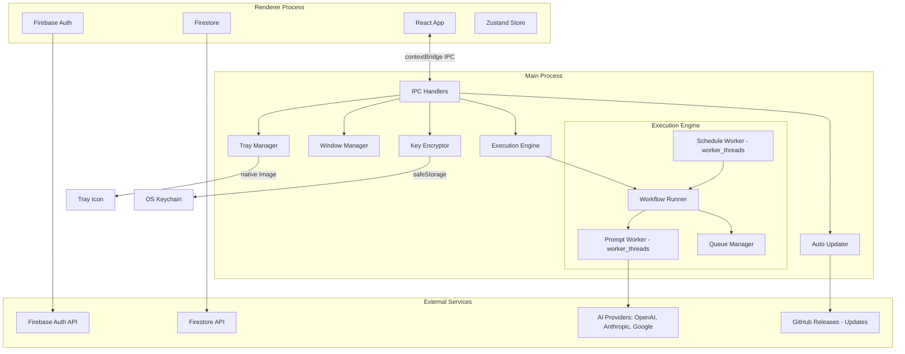

# Architecture Document

**Product:** PromptLoop
**Version:** 1.0
**Last Updated:** 2026-05-17

---

## Table of Contents

- [1. Overview](#1-overview)
- [2. Process Model](#2-process-model)
- [3. Main Process](#3-main-process)
- [4. Renderer Process](#4-renderer-process)
- [5. IPC Communication](#5-ipc-communication)
- [6. Execution Engine](#6-execution-engine)
- [7. Firebase Integration](#7-firebase-integration)
- [8. State Management](#8-state-management)
- [9. Data Flow](#9-data-flow)
- [10. Error Handling Strategy](#10-error-handling-strategy)
- [11. Security Architecture](#11-security-architecture)
- [12. Performance Considerations](#12-performance-considerations)

---

## 1. Overview

PromptLoop uses a standard Electron architecture with two main processes:

- **Main Process** (Node.js) — window management, system tray, execution engine, IPC handlers, auto-updater
- **Renderer Process** (Chromium) — React UI, Firebase SDK, user interaction

All business logic (execution engine, AI provider calls, scheduling) runs in the main process. The renderer is responsible only for UI rendering and user input. Communication between the two happens exclusively through Electron's IPC mechanism via a preload script.

```
┌─────────────────────────────────────────────────────┐
│                  Electron App                        │
│                                                      │
│  ┌──────────────────┐     IPC      ┌──────────────┐ │
│  │  Main Process     │◄──────────►│  Renderer     │ │
│  │  (Node.js)        │             │  (Chromium)   │ │
│  │                    │             │               │ │
│  │  - Window Manager  │             │  - React UI   │ │
│  │  - Execution Eng.  │             │  - Firebase   │ │
│  │  - Tray Manager    │             │    Auth SDK   │ │
│  │  - IPC Handlers    │             │  - Firestore  │ │
│  │  - Key Encryption  │             │    SDK        │ │
│  │  - Auto Updater    │             │  - Zustand    │ │
│  └──────────────────┘             └──────────────┘ │
│                                                      │
│  ┌──────────────────┐                                │
│  │  Preload Script   │                                │
│  │  (contextBridge)  │                                │
│  └──────────────────┘                                │
└─────────────────────────────────────────────────────┘
```

---

## 2. Process Model



### 2.1 Main Process Threads

| Thread | Purpose |
|--------|---------|
| Main thread | Window management, IPC, tray, auto-updater |
| worker_thread: prompt | Sends HTTP requests to AI providers, handles streaming |
| worker_thread: schedule | Checks cron schedules, triggers workflow start |
| worker_thread: encryption | Encrypts/decrypts API keys via safeStorage (if offloading) |

### 2.2 Security Boundaries

- `nodeIntegration`: **false** (renderer cannot access Node.js APIs)
- `contextIsolation`: **true** (renderer and preload run in separate contexts)
- Preload script exposes a minimal, typed API via `contextBridge.exposeInMainWorld`
- Renderer has no direct filesystem, networking (except Firebase), or OS access

---

## 3. Main Process

### 3.1 Window Manager

Responsibilities:
- Create and manage the BrowserWindow
- Track window state (position, size, maximized, minimized)
- Handle minimize-to-tray behavior
- Manage compact mode / full mode transitions
- Persist window state to `electron-store`

```typescript
interface WindowState {
  x: number;
  y: number;
  width: number;
  height: number;
  isMaximized: boolean;
  mode: 'full' | 'compact';
}
```

### 3.2 System Tray Manager

Responsibilities:
- Create tray icon with dynamic status indicator
  - Green dot: running
  - Yellow dot: paused
  - Red dot: error
  - Gray dot: idle
- Context menu: Start/Stop/Pause, Open Window, Quit
- Balloon notifications on workflow events
- Click behavior: toggle window visibility

### 3.3 Key Encryptor

Uses `electron.safeStorage` to encrypt/decrypt API keys locally.

```typescript
interface KeyStore {
  id: string;
  provider: 'openai' | 'anthropic' | 'google';
  keyPrefix: string; // first 8 chars for display
  encryptedKey: Buffer; // safeStorage.encryptString()
  createdAt: string;
}
```

Keys are stored in a local JSON file at:
- macOS: `~/Library/Application Support/PromptLoop/keys.json`
- Windows: `%APPDATA%/PromptLoop/keys.json`
- Linux: `~/.config/PromptLoop/keys.json`

### 3.4 Auto Updater

Uses `electron-updater` with GitHub Releases.

- Checks for updates on startup and every 6 hours
- Downloads in background
- Prompts user to install on next quit or restart now
- Supports macOS (dmg), Windows (nsis), Linux (AppImage)

---

## 4. Renderer Process

### 4.1 Tech Stack

| Library | Purpose |
|---------|---------|
| React 18 | UI framework |
| TypeScript | Type safety |
| Vite | Build tool and dev server |
| React Router v6 | Client-side routing |
| Zustand | State management |
| TanStack Query (React Query) | Firestore data fetching + caching |
| Tailwind CSS | Styling |
| Radix UI / shadcn/ui | Accessible UI primitives |
| Lucide React | Icons |
| Sonner | Toast notifications |

### 4.2 Firebase SDK

The renderer uses the Firebase Web SDK directly:

```typescript
// Firebase config loaded from env vars at build time
import { initializeApp } from 'firebase/app';
import { getAuth, connectAuthEmulator } from 'firebase/auth';
import { getFirestore, connectFirestoreEmulator } from 'firebase/firestore';

const app = initializeApp(firebaseConfig);
export const auth = getAuth(app);
export const db = getFirestore(app);

// In development, connect to Firebase Emulator Suite
if (import.meta.env.DEV) {
  connectAuthEmulator(auth, 'http://localhost:9099');
  connectFirestoreEmulator(db, 'localhost', 8080);
}
```

### 4.3 Preload Script

The preload script exposes a strictly typed API to the renderer:

```typescript
// preload.ts
import { contextBridge, ipcRenderer } from 'electron';

const api = {
  // Workflow control
  startWorkflow: (workflowId: string) =>
    ipcRenderer.invoke('workflow:start', { workflowId }),
  pauseWorkflow: (workflowId: string) =>
    ipcRenderer.invoke('workflow:pause', { workflowId }),
  stopWorkflow: (workflowId: string) =>
    ipcRenderer.invoke('workflow:stop', { workflowId }),
  retryWorkflow: (workflowId: string) =>
    ipcRenderer.invoke('workflow:retry', { workflowId }),

  // Execution listeners
  onExecutionChunk: (callback: (data: ExecutionChunk) => void) => {
    const handler = (_event: any, data: ExecutionChunk) => callback(data);
    ipcRenderer.on('execution:chunk', handler);
    return () => ipcRenderer.removeListener('execution:chunk', handler);
  },
  onExecutionCompleted: (callback: (data: ExecutionResult) => void) => {
    const handler = (_event: any, data: ExecutionResult) => callback(data);
    ipcRenderer.on('execution:completed', handler);
    return () => ipcRenderer.removeListener('execution:completed', handler);
  },
  onExecutionFailed: (callback: (data: ExecutionError) => void) => {
    const handler = (_event: any, data: ExecutionError) => callback(data);
    ipcRenderer.on('execution:failed', handler);
    return () => ipcRenderer.removeListener('execution:failed', handler);
  },
  onWorkflowCompleted: (callback: (data: WorkflowComplete) => void) => {
    const handler = (_event: any, data: WorkflowComplete) => callback(data);
    ipcRenderer.on('workflow:completed', handler);
    return () => ipcRenderer.removeListener('workflow:completed', handler);
  },

  // API Key management
  encryptApiKey: (provider: string, key: string) =>
    ipcRenderer.invoke('api-key:encrypt', { provider, key }),
  decryptApiKey: (keyId: string) =>
    ipcRenderer.invoke('api-key:decrypt', { keyId }),
  deleteApiKey: (keyId: string) =>
    ipcRenderer.invoke('api-key:delete', { keyId }),
  listApiKeys: () =>
    ipcRenderer.invoke('api-key:list'),

  // App controls
  minimizeToTray: () => ipcRenderer.send('app:minimize-to-tray'),
  getAppVersion: () => ipcRenderer.invoke('app:get-version'),
  checkForUpdates: () => ipcRenderer.invoke('app:check-updates'),
  installUpdate: () => ipcRenderer.invoke('app:install-update'),

  // Window mode
  setWindowMode: (mode: 'full' | 'compact') =>
    ipcRenderer.send('app:set-window-mode', { mode }),
};

contextBridge.exposeInMainWorld('electronAPI', api);
```

---

## 5. IPC Communication

### 5.1 Protocol

All IPC uses `ipcMain.handle` / `ipcRenderer.invoke` (request-response) for commands, and `webContents.send` / `ipcRenderer.on` for events.

```
Commands (invoke/handle):
  Renderer ──invoke──► Main ──► response

Events (on/send):
  Main ──send──► Renderer ──on──► handler
```

### 5.2 Channel Reference

See [PRD Section 12](./PRD.md#12-electron-ipc-api) for the complete channel reference.

### 5.3 Execution Event Flow

```
User clicks Start
       │
       ▼
Renderer: invoke('workflow:start', { workflowId })
       │
       ▼
Main: handle('workflow:start')
  → Create WorkflowRunner
  → Load workflow from Firestore
  → Start prompt execution loop
       │
       ▼
Main: send('execution:started', { workflowId, promptId })
       │
       ▼
Renderer: display "Running: Prompt 1"
       │
       ▼
  ┌── Main: send('execution:chunk', { chunk: "..." }) ──► Renderer: append to display
  │  (repeated for each streaming chunk)
  └─────────────────────────────────────────────────────────┘
       │
       ▼
Main: send('execution:completed', { result })
       │
       ▼
Renderer: log result, update progress
       │
       ▼
  (repeat for next prompt)
       │
       ▼
Main: send('workflow:completed', { iterations })
       │
       ▼
Renderer: show completion notification
```

---

## 6. Execution Engine

### 6.1 WorkflowRunner Class

The core of the execution engine. One instance per running workflow.

```typescript
class WorkflowRunner {
  private workflow: Workflow;
  private currentIndex: number = 0;
  private loopCount: number = 0;
  private abortController: AbortController;
  private status: 'idle' | 'running' | 'paused' | 'stopped' | 'error' = 'idle';

  constructor(workflow: Workflow) { ... }

  async start(): Promise<void> {
    this.status = 'running';
    while (this.status === 'running') {
      const prompt = this.getNextActivePrompt();
      if (!prompt) break;

      await this.executePrompt(prompt);
      this.currentIndex++;

      if (this.currentIndex >= this.workflow.prompts.length) {
        if (this.shouldLoop()) {
          this.currentIndex = 0;
          this.loopCount++;
          this.sendStatusUpdate();
        } else {
          break;
        }
      }
    }
    this.status = 'completed';
    this.notifyCompletion();
  }

  pause(): void {
    this.status = 'paused';
    this.sendStatusUpdate();
  }

  resume(): void {
    if (this.status === 'paused') {
      this.status = 'running';
      this.start(); // resumes from currentIndex
    }
  }

  stop(): void {
    this.abortController.abort();
    this.status = 'stopped';
    this.currentIndex = 0;
    this.loopCount = 0;
    this.sendStatusUpdate();
  }

  private async executePrompt(prompt: Prompt): Promise<void> {
    this.sendExecutionStarted(prompt);
    const apiKey = await this.getDecryptedApiKey(prompt.model);

    try {
      const stream = await this.callAIProvider(prompt, apiKey);
      for await (const chunk of stream) {
        if (this.abortController.signal.aborted) break;
        this.sendExecutionChunk(prompt, chunk);
      }
      await this.storeExecutionResult(prompt);
      this.sendExecutionCompleted(prompt);
      await this.delay(prompt.delayMs);
    } catch (error) {
      this.sendExecutionFailed(prompt, error);
      // Retry logic handled here
    }
  }

  private async callAIProvider(prompt: Prompt, apiKey: string): Promise<AsyncIterable<string>> {
    // Uses Vercel AI SDK's streamText or provider-specific streaming
    // Abstracted behind ProviderAdapter interface
    const adapter = ProviderFactory.getAdapter(prompt.model);
    return adapter.stream(prompt.content, {
      apiKey,
      temperature: prompt.temperature,
      maxTokens: prompt.maxTokens,
    });
  }
}
```

### 6.2 Provider Adapter Interface

```typescript
interface ProviderAdapter {
  stream(
    prompt: string,
    options: {
      apiKey: string;
      temperature: number;
      maxTokens: number;
      signal?: AbortSignal;
    }
  ): AsyncIterable<string>;

  models(): ModelInfo[];

  estimateCost(inputTokens: number, outputTokens: number): number;
}
```

### 6.3 Retry Strategy

```typescript
async function executeWithRetry(
  fn: () => Promise<AsyncIterable<string>>,
  maxRetries: number = 3
): Promise<AsyncIterable<string>> {
  for (let attempt = 1; attempt <= maxRetries; attempt++) {
    try {
      return await fn();
    } catch (error) {
      if (attempt === maxRetries) throw error;
      if (isRateLimited(error)) {
        const delay = Math.pow(2, attempt) * 1000; // exponential backoff
        await wait(delay);
      } else if (isServerError(error)) {
        await wait(5000);
      } else {
        throw error; // non-retryable
      }
    }
  }
  throw new Error('All retries exhausted');
}
```

### 6.4 Schedule Worker

Runs on a separate worker_thread. Checks every 60 seconds for workflows with scheduled start times.

```typescript
class ScheduleWorker {
  async run(): Promise<void> {
    while (true) {
      const now = new Date();
      const dueWorkflows = await this.getDueWorkflows(now);
      for (const workflow of dueWorkflows) {
        await this.startWorkflow(workflow.id);
      }
      await wait(60_000); // check every minute
    }
  }

  private async getDueWorkflows(now: Date): Promise<Workflow[]> {
    // Query Firestore for workflows where:
    //   status === 'idle'
    //   loopMode === 'scheduled'
    //   schedule.startTime <= now
    //   (schedule.endTime >= now OR schedule.endTime === null)
    //   AND not already started in this window
  }
}
```

---

## 7. Firebase Integration

### 7.1 Firebase Project Setup

```
├── Authentication
│   ├── Email/Password
│   └── Sign-in providers
│       ├── Google
│       └── GitHub
├── Firestore Database
│   └── Collections (see schema document)
└── Emulator Suite (development)
    ├── firebase emulators:start
    ├── Auth Emulator :9099
    └── Firestore Emulator :8080
```

### 7.2 Firestore Security Rules

```
rules_version = '2';
service cloud.firestore {
  match /databases/{database}/documents {

    // Users can only access their own data
    match /users/{userId} {
      allow read, write: if request.auth != null && request.auth.uid == userId;

      match /workflows/{workflowId} {
        allow read, write: if request.auth != null && request.auth.uid == userId;

        match /prompts/{promptId} {
          allow read, write: if request.auth != null && request.auth.uid == userId;
        }
      }

      match /executions/{executionId} {
        allow read, write: if request.auth != null && request.auth.uid == userId;
      }

      match /apiKeys/{keyId} {
        // Only keyPrefix is stored here; full keys are local
        allow read: if request.auth != null && request.auth.uid == userId;
        allow write: if request.auth != null && request.auth.uid == userId;
      }
    }
  }
}
```

### 7.3 Firestore Indexes

```javascript
// firestore.indexes.json
{
  "indexes": [
    {
      "collectionGroup": "executions",
      "queryScope": "COLLECTION",
      "fields": [
        { "fieldPath": "workflowId", "order": "ASCENDING" },
        { "fieldPath": "createdAt", "order": "DESCENDING" }
      ]
    },
    {
      "collectionGroup": "executions",
      "queryScope": "COLLECTION",
      "fields": [
        { "fieldPath": "status", "order": "ASCENDING" },
        { "fieldPath": "createdAt", "order": "DESCENDING" }
      ]
    },
    {
      "collectionGroup": "prompts",
      "queryScope": "COLLECTION",
      "fields": [
        { "fieldPath": "workflowId", "order": "ASCENDING" },
        { "fieldPath": "position", "order": "ASCENDING" }
      ]
    }
  ]
}
```

### 7.4 Offline Mode

Firestore SDK's offline persistence is enabled. However, workflow execution requires network connectivity to call AI providers. Offline behavior:

| Scenario | Behavior |
|----------|----------|
| No network at app start | Show offline banner, disable workflow start |
| Network lost during execution | Execution continues (no checkpoint until Firestore write); on reconnect, write buffered data |
| Firestore write fails | Buffer log locally; retry on next write or app restart |

---

## 8. State Management

### 8.1 Zustand Store Structure

```typescript
// src/store/index.ts
interface ExecutionStore {
  // Execution state
  activeWorkflowId: string | null;
  executionStatus: 'idle' | 'running' | 'paused' | 'stopped' | 'error';
  currentPromptIndex: number;
  currentPrompt: Prompt | null;
  responseBuffer: string; // accumulated streaming response
  loopIteration: number;
  recentLogs: ExecutionLog[];

  // Actions
  setActiveWorkflow: (id: string | null) => void;
  setExecutionStatus: (status: ExecutionStatus) => void;
  appendResponseChunk: (chunk: string) => void;
  clearResponse: () => void;
  addLog: (log: ExecutionLog) => void;
}

interface WorkflowStore {
  // Data
  workflows: Workflow[];
  activeWorkflowId: string | null;
  isLoading: boolean;

  // Actions
  setWorkflows: (workflows: Workflow[]) => void;
  addWorkflow: (workflow: Workflow) => void;
  updateWorkflow: (id: string, data: Partial<Workflow>) => void;
  removeWorkflow: (id: string) => void;
  setActiveWorkflow: (id: string | null) => void;
}

interface SettingsStore {
  theme: 'light' | 'dark' | 'system';
  windowMode: 'full' | 'compact';
  minimizeToTrayOnClose: boolean;
  notificationsEnabled: boolean;
  startOnBoot: boolean;

  setTheme: (theme: Theme) => void;
  setWindowMode: (mode: WindowMode) => void;
}
```

### 8.2 Data Fetching with TanStack Query

Firestore reads use TanStack Query for caching and deduplication:

```typescript
// src/hooks/useWorkflows.ts
function useWorkflows() {
  return useQuery({
    queryKey: ['workflows', user?.uid],
    queryFn: async () => {
      const snapshot = await getDocs(
        collection(db, 'users', user!.uid, 'workflows')
      );
      return snapshot.docs.map(doc => ({ id: doc.id, ...doc.data() }));
    },
    enabled: !!user,
  });
}

// src/hooks/usePrompts.ts
function usePrompts(workflowId: string) {
  return useQuery({
    queryKey: ['prompts', user?.uid, workflowId],
    queryFn: async () => {
      const snapshot = await getDocs(
        collection(db, 'users', user!.uid, 'workflows', workflowId, 'prompts'),
        orderBy('position', 'asc')
      );
      return snapshot.docs.map(doc => ({ id: doc.id, ...doc.data() }));
    },
    enabled: !!user && !!workflowId,
  });
}
```

---

## 9. Data Flow

### 9.1 Full Execution Lifecycle

```
┌────────────────────────────────────────────────────────────────────┐
│                       EXECUTION LIFECYCLE                          │
├────────────────────────────────────────────────────────────────────┤
│                                                                    │
│ 1. CREATE                                                   USER  │
│    User creates workflow + prompts in the renderer UI               │
│    → Firestore: write to workflows/{id} and prompts/{id}          │
│                                                                    │
│ 2. START                                                    USER  │
│    User clicks "Start" in the renderer                              │
│    → IPC: invoke('workflow:start', { workflowId })                  │
│    → Main: WorkflowRunner.start()                                   │
│    → Firestore: update workflow status → 'running'                 │
│                                                                    │
│ 3. EXECUTE                                                 ENGINE  │
│    For each active prompt:                                         │
│      → Send prompt to AI provider (configured model + API key)     │
│      → Stream response chunks back via IPC                         │
│      → Renderer displays chunks in real-time                       │
│                                                                    │
│ 4. STORE                                                    ENGINE │
│    On completion:                                                  │
│      → Firestore: write to executions/{id} with full result       │
│      → IPC: send('execution:completed')                            │
│                                                                    │
│ 5. DELAY                                                    ENGINE │
│    Wait prompt.delayMs milliseconds                                 │
│                                                                    │
│ 6. LOOP CHECK                                              ENGINE │
│    If more prompts: increment index, go to step 3                  │
│    If last prompt and looping: reset index, increment loopCount    │
│    If last prompt and not looping: go to step 7                    │
│                                                                    │
│ 7. COMPLETE                                                  ENGINE│
│    → Firestore: update workflow status → 'idle'                    │
│    → IPC: send('workflow:completed')                                │
│    → Desktop notification to user                                   │
│                                                                    │
│ 8. VIEW                                                    USER   │
│    User reviews execution logs in the renderer                      │
│    → Firestore: read executions collection                          │
│                                                                    │
└────────────────────────────────────────────────────────────────────┘
```

### 9.2 Auth Flow

```
┌──────────┐         ┌──────────────┐         ┌───────────┐
│ Renderer │         │  Firebase    │         │  Main     │
│          │         │  Auth SDK    │         │  Process  │
├──────────┤         ├──────────────┤         ├───────────┤
│Sign In   │────────►│signInWithPopup│         │           │
│Click     │         │(or email)    │         │           │
│          │         │              │         │           │
│          │◄────────│UserCredential│         │           │
│          │         │+ IdToken     │         │           │
│          │         │              │         │           │
│  Store   │────────►│              │         │           │
│  Auth    │  IPC    │              │         │           │
│  State   │         │              │         │           │
│          │         │              │         │           │
│ onAuth   │◄────────│onIdTokenChanged────────│Verify    │
│ State    │         │(token refresh)│         │Token?    │
│ Changed  │         │              │         │           │
└──────────┘         └──────────────┘         └───────────┘
```

---

## 10. Error Handling Strategy

### 10.1 Error Categories

| Category | Examples | Handling |
|----------|----------|----------|
| Provider Errors | Rate limit, auth failure, server error, timeout | Retry with backoff, then mark failed |
| Network Errors | DNS failure, connection refused, socket hangup | Retry with backoff, then mark failed |
| Firestore Errors | Permission denied, write failure, quota exceeded | Buffer locally, retry, show warning |
| App Errors | Crash, OOM, uncaught exception | Sentry report, auto-restart |
| User Errors | Invalid prompt, missing API key, disabled workflow | Validate before execution, show inline error |

### 10.2 Error Recovery Matrix

```typescript
const errorHandlingMatrix = {
  'provider:429': {
    recoverable: true,
    action: 'backoff',
    maxRetries: 3,
    backoffMs: [1000, 4000, 15000],
    notify: false,
  },
  'provider:401': {
    recoverable: false,
    action: 'pause-workflow',
    maxRetries: 0,
    notify: true,
    message: 'API key is invalid or expired. Please update your key.',
  },
  'provider:timeout': {
    recoverable: true,
    action: 'retry-once',
    maxRetries: 1,
    backoffMs: [0],
    notify: false,
  },
  'firestore:permission-denied': {
    recoverable: false,
    action: 'stop-workflow',
    maxRetries: 0,
    notify: true,
    message: 'Permission denied. Please re-authenticate.',
  },
  'network:offline': {
    recoverable: true,
    action: 'wait-and-retry',
    maxRetries: Infinity, // retry until online
    backoffMs: [5000],
    notify: true,
  },
};
```

### 10.3 Crash Recovery

When the app is quit or crashes during execution:

1. On next startup, check Firestore for workflows with status `running`
2. Check the last execution record for the workflow
3. If the last execution was more than 5 minutes ago, mark it as `failed` with reason `app_restart`
4. Set workflow status to `error` with message: "Workflow was interrupted by app restart"
5. Notify user and offer to resume from the last incomplete prompt

---

## 11. Security Architecture

### 11.1 Threat Model

| Threat | Mitigation |
|--------|-----------|
| XSS in renderer | CSP headers, contextIsolation, no nodeIntegration |
| API key theft | safeStorage encryption, never in Firestore |
| Firestore data access | Security rules restrict to auth.uid == userId |
| Man-in-the-middle | HTTPS for all external calls, Firebase SDK handles cert validation |
| Code injection | TypeScript + strict ESLint, no eval(), no dynamic require |
| Supply chain | npm audit in CI, lockfile, dependabot |
| Auto-update hijack | Code signing (macOS notarization, Windows Authenticode), electron-updater URL pinning |

### 11.2 Content Security Policy

```html
<meta
  http-equiv="Content-Security-Policy"
  content="default-src 'self';
           script-src 'self';
           style-src 'self' 'unsafe-inline';
           img-src 'self' data:;
           connect-src 'self'
             https://*.firebaseio.com
             https://*.googleapis.com
             https://api.openai.com
             https://api.anthropic.com
             https://generativelanguage.googleapis.com;
           font-src 'self' data:;"
/>
```

---

## 12. Performance Considerations

### 12.1 Main Process

- Keep main process responsive: offload AI provider calls to worker_threads
- Use AbortController for all cancellable operations
- Limit concurrent Firestore listeners: one per open workflow
- Throttle IPC events: batch chunk updates at 60fps max

### 12.2 Renderer

- Virtualize long prompt lists (react-window or tanstack-virtual)
- Debounce Firestore writes: batch updates, don't write on every keystroke
- Limit execution log display: show last 100, load more on scroll
- Lazy load route components with React.Suspense
- Use CSS animations instead of JS for performance-sensitive transitions

### 12.3 Memory Targets

| State | Target |
|-------|--------|
| Idle (no workflows open) | < 150 MB |
| Editing workflow (Firestore fetched) | < 250 MB |
| Active execution (streaming response) | < 400 MB |
| Peak (large log history loaded) | < 600 MB |

### 12.4 Startup Time Targets

| Milestone | Target |
|-----------|--------|
| App icon appears in dock | < 2s |
| Auth state resolved | < 3s |
| Dashboard loaded with data | < 4s |
| Full interactivity | < 5s |
