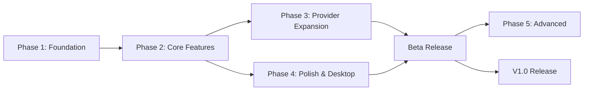

# Development Roadmap

**Product:** PromptLoop
**Version:** 1.0
**Last Updated:** 2026-05-17

---

## Table of Contents

- [1. Overview](#1-overview)
- [2. Phase 1 — Foundation](#2-phase-1--foundation)
- [3. Phase 2 — Core Features](#3-phase-2--core-features)
- [4. Phase 3 — Provider Expansion](#4-phase-3--provider-expansion)
- [5. Phase 4 — Polish & Desktop Features](#5-phase-4--polish--desktop-features)
- [6. Phase 5 — Advanced Features (post-MVP)](#6-phase-5--advanced-features-post-mvp)
- [7. Release Criteria](#7-release-criteria)
- [8. Estimated Timeline](#8-estimated-timeline)
- [9. Milestone Dependencies](#9-milestone-dependencies)
- [10. Risk-Adjusted Timeline](#10-risk-adjusted-timeline)

---

## 1. Overview

PromptLoop is developed in 5 phases. Phases 1-4 deliver the MVP (minimum viable product). Phase 5 covers post-MVP features.

**Total estimated time to MVP:** 12-15 weeks (3-4 months)

---

## 2. Phase 1 — Foundation

**Goal:** Working Electron app shell with Firebase Auth, project structure, and design system.

**Duration:** 3-4 weeks

### Week 1: Project Scaffolding

- [ ] Initialize project with `electron-vite` (or `vite-plugin-electron`)
- [ ] Configure TypeScript (strict mode)
- [ ] Set up ESLint + Prettier with consistent config
- [ ] Install and configure Tailwind CSS
- [ ] Create project directory structure (`electron/main/`, `electron/preload/`, `src/`)
- [ ] Set up basic Electron main process (BrowserWindow, load renderer)
- [ ] Verify dev workflow: `npm run dev` launches Electron + Vite HMR
- [ ] Configure `electron-builder` for dev builds
- [ ] Set up preload script with `contextBridge`
- [ ] **Deliverable:** Electron window opens with "Hello PromptLoop"

### Week 2: Firebase Integration

- [ ] Create Firebase project (Auth + Firestore)
- [ ] Install Firebase Web SDK
- [ ] Initialize Firebase in renderer
- [ ] Set up Firebase Emulator Suite for local development
- [ ] Implement `AuthProvider` context
- [ ] Build `LoginPage` with email/password form
- [ ] Build `OAuthButtons` (Google, GitHub)
- [ ] Implement `ProtectedRoute` component
- [ ] Wire up `onAuthStateChanged` to Zustand store
- [ ] Test full auth flow in Firebase Emulator
- [ ] **Deliverable:** User can sign up, sign in, sign out

### Week 3: Design System & Layout

- [ ] Install shadcn/ui (button, input, dialog, card, badge, etc.)
- [ ] Create `AppLayout` with sidebar navigation
- [ ] Build sidebar with nav items and user menu
- [ ] Create `PageHeader` shared component
- [ ] Build `StatusBar` with app version and execution indicator
- [ ] Set up React Router with HashRouter
- [ ] Create placeholder pages (Dashboard, Settings)
- [ ] Implement dark/light theme toggle in Zustand
- [ ] Create `EmptyState` shared component
- [ ] Set up Sonner toast notifications
- [ ] **Deliverable:** Navigable app shell with auth, theme toggle, and all route placeholders

### Week 4: Zustand & IPC Foundation

- [ ] Create all Zustand stores (execution, workflow, settings)
- [ ] Set up Zustand persist middleware with `electron-store`
- [ ] Implement IPC bridge types in `electron/shared/types.ts`
- [ ] Create main process IPC handlers skeleton
- [ ] Create preload API with type-safe wrapper
- [ ] Write `useIpc` hook for renderer
- [ ] Test IPC round-trip (renderer calls main, main responds)
- [ ] Set up Sentry for error tracking (main + renderer)
- [ ] **Deliverable:** Full IPC bridge operational, stores connected, error tracking live

### Phase 1 Gate: Working Electron app with auth, routing, layout, and IPC bridge

```
Checklist:
☐ App launches in dev mode
☐ User can sign up / sign in / sign out
☐ User sees sidebar navigation
☐ Dark/light theme works
☐ IPC communication works
☐ Zustand stores persist settings
☐ Firebase Emulator works locally
```

---

## 3. Phase 2 — Core Features

**Goal:** Complete workflow/prompt CRUD with Firestore sync, execution engine, and execution viewer.

**Duration:** 4-5 weeks

### Week 5: Firestore Data Layer

- [ ] Define Firestore security rules
- [ ] Create Firestore indexes configuration
- [ ] Write Firestore data converters (Date ↔ Timestamp)
- [ ] Implement `useWorkflows` hook (TanStack Query)
- [ ] Implement `usePrompts` hook (TanStack Query)
- [ ] Add real-time `onSnapshot` listener for active workflow
- [ ] Set up Firestore write helpers with optimistic updates
- [ ] Test CRUD operations with Firebase Emulator
- [ ] **Deliverable:** Workflows and prompts persist to Firestore

### Week 6: Workflow Editor

- [ ] Build `WorkflowEditorPage` layout
- [ ] Create workflow name input and settings section
- [ ] Build `PromptCard` component (draggable)
- [ ] Install `@hello-pangea/dnd` (maintained fork of react-beautiful-dnd)
- [ ] Implement drag-and-drop reordering
- [ ] Build `PromptEditorPanel` (slide-over)
- [ ] Create prompt form fields (content, model, temperature, tokens, delay)
- [ ] Implement auto-save (debounced writes to Firestore)
- [ ] Build `AddPromptButton`
- [ ] Handle create vs edit mode (new vs existing workflow)
- [ ] **Deliverable:** Full workflow editor with drag-and-drop and auto-save

### Week 7: Execution Engine

- [ ] Create `WorkflowRunner` class in main process
- [ ] Implement state machine (idle → running → paused → stopped → error)
- [ ] Build `QueueManager` (in-process promise chain)
- [ ] Create `ProviderAdapter` interface
- [ ] Implement OpenAI provider adapter
- [ ] Wire up `workflow:start/pause/stop/retry` IPC handlers
- [ ] Send execution events from main → renderer via IPC
- [ ] Implement streaming response handling
- [ ] Add delay timing between prompts
- [ ] Implement loop logic (infinite, fixed iterations, single pass)
- [ ] **Deliverable:** Workflows execute sequentially with streaming, pausing, and looping

### Week 8: Execution Viewer

- [ ] Build `ExecutionViewerPage` layout
- [ ] Create `ExecutionControls` (Start/Pause/Stop/Retry)
- [ ] Build `PromptProgressBar` (queue progress)
- [ ] Create `StreamingText` component (real-time response display)
- [ ] Build `QueueItem` list with animated status
- [ ] Display loop iteration counter
- [ ] Wire IPC events to Zustand store
- [ ] Add execution logs via Firestore on prompt completion
- [ ] Build `ExecutionLogTable`
- [ ] Handle all states (not started, running, paused, completed, error)
- [ ] **Deliverable:** Full execution viewer with live streaming and logs

### Week 9: API Key Management + Dashboard

- [ ] Create `KeyEncryptor` in main process (electron.safeStorage)
- [ ] Implement `api-key:encrypt/decrypt/list/delete` IPC handlers
- [ ] Store encrypted keys in local JSON file
- [ ] Build `ApiKeysSettings` page
- [ ] Build `AddApiKeyDialog` with provider selector
- [ ] Build `DashboardPage` with workflow cards
- [ ] Create `WorkflowCard` with status badge and quick actions
- [ ] Add quick stats (total runs, success rate, active count)
- [ ] Wire dashboard cards to Start/Edit/Delete
- [ ] **Deliverable:** API key management and dashboard are functional

### Phase 2 Gate: Full MVP workflow — create prompts, run them, see results

```
Checklist:
☐ User can create workflows with prompts
☐ Prompts are reorderable via drag-and-drop
☐ Workflow executes sequentially
☐ Responses stream in real-time
☐ User can pause, resume, and stop execution
☐ Looping works (infinite + fixed)
☐ Execution logs persist to Firestore
☐ API keys can be added and are encrypted locally
☐ Dashboard shows all workflows with status
```

---

## 4. Phase 3 — Provider Expansion

**Goal:** Support all three V1 AI providers with consistent error handling.

**Duration:** 2-3 weeks

### Week 10: Anthropic Integration

- [ ] Install `@ai-sdk/anthropic`
- [ ] Create Anthropic provider adapter
- [ ] Implement streaming for Claude models
- [ ] Add model list to `ModelSelector`
- [ ] Test with Claude 3 Opus, Sonnet, Haiku
- [ ] **Deliverable:** Anthropic models work in workflows

### Week 11: Google Gemini Integration

- [ ] Install `@ai-sdk/google`
- [ ] Create Google provider adapter
- [ ] Implement streaming for Gemini models
- [ ] Add model list to `ModelSelector`
- [ ] Test with Gemini 1.5 Pro, Flash
- [ ] **Deliverable:** Google models work in workflows

### Week 12: Provider Error Handling

- [ ] Implement unified error handling for all providers
- [ ] Add rate limit detection and exponential backoff
- [ ] Implement retry logic with configurable max retries
- [ ] Handle provider-specific errors (401, 429, 500, timeout)
- [ ] Display provider-specific error messages in UI
- [ ] Test with each provider's edge cases
- [ ] **Deliverable:** Consistent error handling across all providers

### Phase 3 Gate: All three providers functional with error handling

```
Checklist:
☐ OpenAI models work with streaming
☐ Anthropic models work with streaming
☐ Google models work with streaming
☐ Model selector shows providers grouped by provider
☐ Rate limits handled with backoff
☐ Provider errors display actionable messages
☐ Retry mechanism recovers from transient failures
```

---

## 5. Phase 4 — Polish & Desktop Features

**Goal:** Desktop-native experience — tray, notifications, auto-update, keyboard shortcuts.

**Duration:** 3-4 weeks

### Week 13: System Tray

- [ ] Create `TrayManager` class in main process
- [ ] Build dynamic tray icon (status-based: green/yellow/red/gray)
- [ ] Implement tray context menu (Start/Stop/Pause, Open, Quit)
- [ ] Wire tray actions to execution engine
- [ ] Implement minimize-to-tray on window close
- [ ] Add click-to-toggle-window behavior
- [ ] Set tray tooltip to show active workflow name/status
- [ ] **Deliverable:** Tray icon with status and controls

### Week 14: Desktop Notifications

- [ ] Implement `NotificationManager` in main process
- [ ] Send desktop notification on workflow completion
- [ ] Send desktop notification on workflow failure
- [ ] Add error/rate limit notifications
- [ ] Make notifications configurable in settings
- [ ] Test on all platforms (macOS, Windows, Linux)
- [ ] **Deliverable:** Desktop notifications for key events

### Week 15: Keyboard Shortcuts + Window Management

- [ ] Register global keyboard shortcuts in main process
- [ ] Implement `Cmd+Enter` (start), `Cmd+Shift+Enter` (pause), `Cmd+.` (stop)
- [ ] Add `Cmd+N` (new workflow), `Cmd+S` (save), `Cmd+,` (settings)
- [ ] Disable shortcuts when focused on text inputs
- [ ] Build compact window mode (mini execution viewer)
- [ ] Persist window position, size, and mode
- [ ] Implement `WindowManager` state persistence
- [ ] **Deliverable:** Desktop-native keyboard shortcuts and window management

### Week 16: Auto-Update + Final Polish

- [ ] Configure `electron-updater` with GitHub Releases
- [ ] Implement update check on startup
- [ ] Build update UI (available prompt, download progress, install)
- [ ] Add app icon (all platform formats: icns, ico, png)
- [ ] Polish loading states and transitions
- [ ] Add skeleton screens for all pages
- [ ] Performance audit (memory, startup time, IPC latency)
- [ ] Final bug bash
- [ ] **Deliverable:** Auto-updating app ready for beta release

### Phase 4 Gate: Production-ready desktop app

```
Checklist:
☐ System tray works on all platforms
☐ Desktop notifications fire on events
☐ Keyboard shortcuts work globally
☐ Window state persists across restarts
☐ Compact mode works
☐ Auto-update downloads and installs updates
☐ App has proper icon
☐ Loading states exist for all data fetching
☐ Sentry reports errors
☐ Binary builds for macOS, Windows, Linux
```

---

## 6. Phase 5 — Advanced Features (post-MVP)

**Goal:** Expand with scheduling, variables, context chaining, and more.

**Duration:** Ongoing

### Scheduling
- [ ] Build `ScheduleWorker` in main process
- [ ] Implement cron expression parser
- [ ] Create schedule picker UI (once, daily, weekly, cron)
- [ ] Schedule tab in workflow editor
- [ ] Test scheduled start/stop across timezones

### Template Variables
- [ ] Build variable resolver in execution engine
- [ ] Support `{{variable}}` syntax in prompt content
- [ ] Create variable editor in prompt panel
- [ ] Variable types: static, random, date

### Context Chaining
- [ ] Add `{{prompt[n].response}}` syntax
- [ ] Store previous responses in execution context
- [ ] Resolve chained variables before sending

### Conditional Logic
- [ ] Add condition editor to workflow builder
- [ ] Condition types: contains, matches, equals, length
- [ ] Actions: skip, retry, branch
- [ ] Implement condition evaluator in execution engine

### Polish & Performance
- [ ] Virtual list for log table (react-window)
- [ ] Lazy load route components
- [ ] Memory profiling and leak fixes
- [ ] E2E tests with Playwright + Electron

---

## 7. Release Criteria

### Alpha Release (End of Phase 2)
- Core workflow execution works
- Single user, local execution only
- Manual testing only

### Beta Release (End of Phase 4)
- All MVP features complete
- Auto-update operational
- Tested on macOS, Windows, Linux
- Sentry error tracking active
- Beta testers invited

### V1.0 Release (After Beta QA)
- All beta bugs fixed
- Documentation complete
- Performance targets met
- App store submissions (optional)

---

## 8. Estimated Timeline

```
Phase 1: Foundation          ████████░░░░░░░░░░░░░░░░░░░   4 weeks
Phase 2: Core Features       ██████████████████░░░░░░░░░   5 weeks
Phase 3: Provider Expansion  ██████░░░░░░░░░░░░░░░░░░░░░   3 weeks
Phase 4: Polish & Desktop    ████████░░░░░░░░░░░░░░░░░░░   4 weeks
─────────────────────────────────────────────────────────
MVP Complete                  █████████████████████░░░░░░  16 weeks
Phase 5: Advanced             ░░░░░░░░░░░░░░░░░░░░░░░░░░   Ongoing
```

**Optimistic MVP:** 12 weeks (if Phase 4 scope is reduced)
**Realistic MVP:** 16 weeks (with buffer for unexpected issues)
**Conservative MVP:** 20 weeks (with scope creep and learning curve)

---

## 9. Milestone Dependencies



### Hard Dependencies

| Dependent On | Dependency | Reason |
|-------------|------------|--------|
| Phase 2 | Phase 1 | Need auth + IPC before execution engine |
| Phase 3 | Phase 2 | Need execution engine before adding providers |
| Phase 4 (partially) | Phase 2 | Tray controls need execution engine |
| Beta Release | Phase 3 + Phase 4 | All providers + desktop features |
| Phase 5 | Beta Release | Advanced features build on stable foundation |

### Parallelizable Work

- Phase 3 (Anthropic + Google) can start during Week 8-9 (late Phase 2)
- Phase 4 early work (tray icon design, shortcut planning) can start in parallel with Phase 3
- Documentation and E2E tests can start during Phase 4

---

## 10. Risk-Adjusted Timeline

| Risk | Impact | Likelihood | Mitigation | Timeline Buffer |
|------|--------|------------|------------|-----------------|
| Firebase + Electron OAuth complexity | High | Medium | Prototype auth flow in Week 2; fallback to custom OAuth handling | +1 week |
| Streaming response parsing differences across providers | Medium | High | Start with OpenAI (simplest), then adapt; abstract early | +1 week |
| electron-updater signing/certificate issues | Medium | High | Research requirements in Week 1; get certificates ordered early | +1 week |
| Drag-and-drop library compatibility | Low | Medium | Test @hello-pangea/dnd in Week 1 spike | +0.5 weeks |
| Firestore security rules learning curve | Low | Medium | Use emulator from day 1; get rules right early | +0.5 weeks |
| Cross-platform tray icon differences | Low | Medium | Abstract icon creation; test on each OS early | +0.5 weeks |

**Contingency budget:** 4 weeks (included in the conservative estimate)
