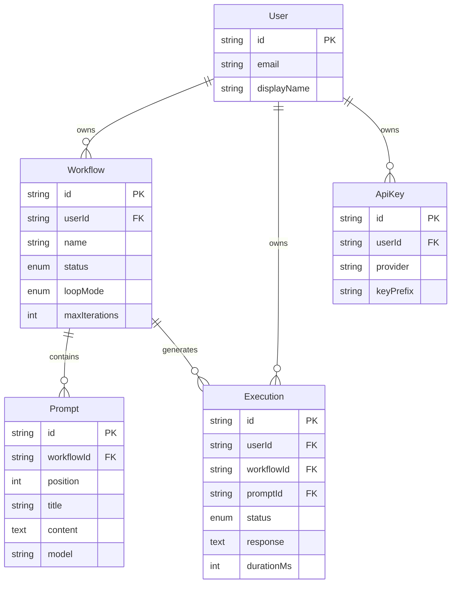

# Data Model & Schema

**Product:** PromptLoop
**Version:** 1.0
**Last Updated:** 2026-05-17

---

## Table of Contents

- [1. Firestore Document Model](#1-firestore-document-model)
- [2. Firestore Indexes](#2-firestore-indexes)
- [3. Local State Model](#3-local-state-model)
- [4. IPC Message Types](#4-ipc-message-types)
- [5. TypeScript Types](#5-typescript-types)
- [6. Data Relationships](#6-data-relationships)
- [7. Migration Strategy](#7-migration-strategy)

---

## 1. Firestore Document Model

### 1.1 Users Collection

Path: `users/{userId}`

```typescript
interface UserProfile {
  email: string;
  displayName: string;
  photoURL: string | null;
  createdAt: Timestamp;
  lastLoginAt: Timestamp;
  settings: {
    theme: 'light' | 'dark' | 'system';
    minimizeToTrayOnClose: boolean;
    notificationsEnabled: boolean;
    startOnBoot: boolean;
  };
}
```

Security: `request.auth.uid == userId`

### 1.2 Workflows Subcollection

Path: `users/{userId}/workflows/{workflowId}`

```typescript
interface Workflow {
  name: string;
  description: string;
  status: 'idle' | 'running' | 'paused' | 'stopped' | 'error';
  loopMode: 'infinite' | 'fixed' | 'scheduled' | 'single';
  maxIterations: number | null;        // for fixed mode
  currentIteration: number;            // 0-indexed, updated live
  currentPromptIndex: number;          // for pause/resume
  schedule: ScheduleConfig | null;     // for scheduled mode
  sortOrder: number;                   // for dashboard ordering
  createdAt: Timestamp;
  updatedAt: Timestamp;
}

interface ScheduleConfig {
  type: 'once' | 'daily' | 'weekly' | 'cron';
  startTime: Timestamp | null;
  endTime: Timestamp | null;
  daysOfWeek: number[] | null;         // 0=Sun, 6=Sat, for weekly
  cronExpression: string | null;       // for cron mode
}
```

Security: `request.auth.uid == userId`

### 1.3 Prompts Subcollection

Path: `users/{userId}/workflows/{workflowId}/prompts/{promptId}`

```typescript
interface Prompt {
  position: number;                    // 0-indexed order
  title: string;
  content: string;                     // template with {{variable}} support
  model: string;                       // 'gpt-4', 'claude-3-opus', etc.
  temperature: number;                 // 0.0 - 2.0
  maxTokens: number;
  delayMs: number;                     // 0 - 300000
  enabled: boolean;
  systemPrompt: string | null;         // optional system message
  variables: VariableDef[] | null;     // for template variables
  createdAt: Timestamp;
  updatedAt: Timestamp;
}

interface VariableDef {
  name: string;                        // used as {{name}} in content
  type: 'static' | 'random' | 'date';
  value: string;                       // static value
  options: string[];                   // for random selection (future)
}
```

Security: `request.auth.uid == userId`

### 1.4 Executions Subcollection

Path: `users/{userId}/executions/{executionId}`

```typescript
interface Execution {
  workflowId: string;                  // reference to parent workflow
  workflowName: string;                // denormalized for display
  promptId: string;                    // reference to parent prompt
  promptTitle: string;                 // denormalized for display
  promptSent: string;                  // actual text sent (with variables resolved)
  response: string;                    // full AI response
  status: 'pending' | 'running' | 'completed' | 'failed' | 'retrying';
  inputTokens: number | null;
  outputTokens: number | null;
  durationMs: number | null;
  errorMessage: string | null;
  httpStatus: number | null;
  model: string;                       // model used
  iteration: number;                   // which loop iteration
  createdAt: Timestamp;
}
```

Security: `request.auth.uid == userId`

Indexes:
- `workflowId ASC, createdAt DESC` — for log viewer
- `status ASC, createdAt DESC` — for monitoring

### 1.5 API Keys Subcollection

Path: `users/{userId}/apiKeys/{keyId}`

```typescript
interface ApiKeyMetadata {
  provider: 'openai' | 'anthropic' | 'google';
  keyPrefix: string;                   // first 8 chars, e.g. 'sk-proj-...'
  isActive: boolean;
  createdAt: Timestamp;
  lastUsedAt: Timestamp | null;
  // NOTE: The full API key is NEVER stored in Firestore.
  // It is encrypted locally via electron.safeStorage.
}
```

Security:
```
allow read: if request.auth != null && request.auth.uid == userId;
allow write: if request.auth.uid == userId
  // Validate that keyPrefix is not the full key (max 20 chars)
  && request.resource.data.keyPrefix.size() <= 20;
```

---

## 2. Firestore Indexes

```json
{
  "indexes": [
    {
      "collectionGroup": "executions",
      "queryScope": "COLLECTION",
      "fields": [
        { "fieldPath": "workflowId", "order": "ASCENDING" },
        { "fieldPath": "createdAt", "order": "DESCENDING" }
      ]
    },
    {
      "collectionGroup": "executions",
      "queryScope": "COLLECTION",
      "fields": [
        { "fieldPath": "status", "order": "ASCENDING" },
        { "fieldPath": "createdAt", "order": "DESCENDING" }
      ]
    }
  ],
  "fieldOverrides": []
}
```

---

## 3. Local State Model

### 3.1 Zustand Stores

#### Execution Store (`executionStore.ts`)

```typescript
interface ExecutionState {
  // Active execution
  activeWorkflowId: string | null;
  executionStatus: 'idle' | 'running' | 'paused' | 'stopped' | 'error';
  currentPromptIndex: number;
  currentPrompt: Prompt | null;
  responseBuffer: string;              // accumulated streaming response
  loopIteration: number;

  // History
  recentLogs: ExecutionLog[];          // last 100 in memory

  // Actions
  startExecution: (workflowId: string) => void;
  pauseExecution: () => void;
  stopExecution: () => void;
  setExecutionStatus: (status: ExecutionState['executionStatus']) => void;
  appendResponseChunk: (chunk: string) => void;
  clearResponse: () => void;
  addLog: (log: ExecutionLog) => void;
  clearLogs: () => void;
}
```

#### Workflow Store (`workflowStore.ts`)

```typescript
interface WorkflowState {
  // Data
  workflows: Workflow[];
  activeWorkflowId: string | null;
  prompts: Map<string, Prompt[]>;      // workflowId -> prompts

  // Loading
  isLoadingWorkflows: boolean;
  isLoadingPrompts: boolean;

  // Error
  error: string | null;

  // Actions
  setWorkflows: (workflows: Workflow[]) => void;
  addWorkflow: (workflow: Workflow) => void;
  updateWorkflow: (id: string, data: Partial<Workflow>) => void;
  removeWorkflow: (id: string) => void;
  setActiveWorkflow: (id: string | null) => void;
  setPrompts: (workflowId: string, prompts: Prompt[]) => void;
}
```

#### Settings Store (`settingsStore.ts`)

```typescript
interface SettingsState {
  // Display
  theme: 'light' | 'dark' | 'system';
  sidebarCollapsed: boolean;

  // Behavior
  minimizeToTrayOnClose: boolean;
  notificationsEnabled: boolean;
  startOnBoot: boolean;

  // Data
  apiKeys: ApiKeyInfo[];               // only metadata (prefix + provider)

  // Actions
  setTheme: (theme: SettingsState['theme']) => void;
  toggleSidebar: () => void;
  setMinimizeToTray: (enabled: boolean) => void;
  setNotifications: (enabled: boolean) => void;
  setStartOnBoot: (enabled: boolean) => void;
  addApiKey: (key: ApiKeyInfo) => void;
  removeApiKey: (keyId: string) => void;
}
```

### 3.2 Persisted State

Settings store is persisted to disk via Zustand's `persist` middleware with `electron-store` storage adapter:

```typescript
import { persist } from 'zustand/middleware';
import ElectronStore from 'electron-store';

const electronStore = new ElectronStore({
  name: 'settings',
  encryptionKey: 'promptloop-settings', // basic obfuscation
});

const useSettingsStore = create<SettingsState>()(
  persist(
    (set) => ({
      // ... state and actions
    }),
    {
      name: 'settings',
      storage: {
        getItem: (key) => electronStore.get(key) as string | null,
        setItem: (key, value) => electronStore.set(key, value),
        removeItem: (key) => electronStore.delete(key),
      },
    }
  )
);
```

---

## 4. IPC Message Types

### 4.1 Command Types (invoke/handle)

```typescript
// electron/shared/types.ts

// === Workflow Commands ===
interface WorkflowStartPayload {
  workflowId: string;
}
interface WorkflowStartResponse {
  success: boolean;
  error?: string;
}

interface WorkflowPausePayload {
  workflowId: string;
}
interface WorkflowPauseResponse {
  success: boolean;
}

interface WorkflowStopPayload {
  workflowId: string;
}
interface WorkflowStopResponse {
  success: boolean;
}

interface WorkflowRetryPayload {
  workflowId: string;
}
interface WorkflowRetryResponse {
  success: boolean;
}

// === API Key Commands ===
interface ApiKeyEncryptPayload {
  provider: string;
  key: string;
}
interface ApiKeyEncryptResponse {
  keyId: string;
  keyPrefix: string;
}

interface ApiKeyDecryptPayload {
  keyId: string;
}
interface ApiKeyDecryptResponse {
  key: string;
}

interface ApiKeyDeletePayload {
  keyId: string;
}
interface ApiKeyDeleteResponse {
  success: boolean;
}

interface ApiKeyListResponse {
  keys: ApiKeyMetadata[];
}
```

### 4.2 Event Types (on/send)

```typescript
interface ExecutionStartedEvent {
  workflowId: string;
  promptId: string;
  promptTitle: string;
  position: { current: number; total: number };
  iteration: number;
}

interface ExecutionChunkEvent {
  workflowId: string;
  promptId: string;
  chunk: string;
}

interface ExecutionCompletedEvent {
  workflowId: string;
  promptId: string;
  result: {
    response: string;
    inputTokens: number;
    outputTokens: number;
    durationMs: number;
  };
}

interface ExecutionFailedEvent {
  workflowId: string;
  promptId: string;
  error: {
    code: string;
    message: string;
    recoverable: boolean;
  };
}

interface WorkflowCompletedEvent {
  workflowId: string;
  iterations: number;
  totalExecutions: number;
}

interface WorkflowStatusEvent {
  workflowId: string;
  status: Workflow['status'];
  position: { current: number; total: number };
  iteration: number;
}

interface AppUpdateEvent {
  version: string;
  releaseDate: string;
  releaseNotes: string;
}
```

---

## 5. TypeScript Types

### 5.1 Core Domain Types

```typescript
// === Domain Models ===

interface User {
  uid: string;
  email: string;
  displayName: string;
  photoURL: string | null;
}

interface Workflow {
  id: string;
  name: string;
  description: string;
  status: WorkflowStatus;
  loopMode: LoopMode;
  maxIterations: number | null;
  currentIteration: number;
  currentPromptIndex: number;
  schedule: ScheduleConfig | null;
  sortOrder: number;
  createdAt: Date;
  updatedAt: Date;
}

type WorkflowStatus = 'idle' | 'running' | 'paused' | 'stopped' | 'error';
type LoopMode = 'infinite' | 'fixed' | 'scheduled' | 'single';

interface ScheduleConfig {
  type: 'once' | 'daily' | 'weekly' | 'cron';
  startTime: Date | null;
  endTime: Date | null;
  daysOfWeek: number[] | null;
  cronExpression: string | null;
}

interface Prompt {
  id: string;
  workflowId: string;
  position: number;
  title: string;
  content: string;
  model: string;
  temperature: number;
  maxTokens: number;
  delayMs: number;
  enabled: boolean;
  systemPrompt: string | null;
  variables: VariableDef[] | null;
  createdAt: Date;
  updatedAt: Date;
}

interface VariableDef {
  name: string;
  type: 'static' | 'random' | 'date';
  value: string;
  options: string[];
}

interface Execution {
  id: string;
  workflowId: string;
  workflowName: string;
  promptId: string;
  promptTitle: string;
  promptSent: string;
  response: string;
  status: ExecutionStatus;
  inputTokens: number | null;
  outputTokens: number | null;
  durationMs: number | null;
  errorMessage: string | null;
  httpStatus: number | null;
  model: string;
  iteration: number;
  createdAt: Date;
}

type ExecutionStatus = 'pending' | 'running' | 'completed' | 'failed' | 'retrying';

interface ApiKeyInfo {
  id: string;
  provider: 'openai' | 'anthropic' | 'google';
  keyPrefix: string;
  isActive: boolean;
  createdAt: Date;
  lastUsedAt: Date | null;
}

// === View Models (UI-specific) ===

interface WorkflowWithStats extends Workflow {
  promptCount: number;
  activePromptCount: number;
  lastExecutionAt: Date | null;
  totalExecutions: number;
  failedExecutions: number;
  avgResponseTime: number | null;
}

interface ExecutionLog {
  id: string;
  timestamp: Date;
  promptTitle: string;
  status: ExecutionStatus;
  duration: string;        // formatted, e.g. "2.3s"
  tokens: string;          // formatted, e.g. "150/450"
  error: string | null;
}

interface ModelInfo {
  id: string;              // 'gpt-4' etc.
  provider: string;        // 'openai' etc.
  displayName: string;     // 'GPT-4' etc.
  maxTokens: number;
  supportsStreaming: boolean;
  costPer1KInput: number;
  costPer1KOutput: number;
}
```

### 5.2 Firestore Converters

```typescript
// src/lib/firestore.ts

import { Timestamp } from 'firebase/firestore';

// Firestore stores dates as Timestamps. These converters
// automatically convert to/from JavaScript Date objects.

const workflowConverter = {
  toFirestore(workflow: Partial<Workflow>): Record<string, any> {
    return {
      ...workflow,
      updatedAt: Timestamp.now(),
    };
  },
  fromFirestore(snapshot: DocumentSnapshot): Workflow {
    const data = snapshot.data()!;
    return {
      id: snapshot.id,
      ...data,
      createdAt: data.createdAt.toDate(),
      updatedAt: data.updatedAt.toDate(),
      schedule: data.schedule ? {
        ...data.schedule,
        startTime: data.schedule.startTime?.toDate() ?? null,
        endTime: data.schedule.endTime?.toDate() ?? null,
      } : null,
    };
  },
};
```

---

## 6. Data Relationships



### Read Patterns

| Pattern | Query | Frequency |
|---------|-------|-----------|
| Load dashboard | `getDocs(workflows)` ordered by sortOrder | On page load |
| Load workflow editor | `getDocs(prompts)` ordered by position | On workflow open |
| Load execution logs | `getDocs(executions)` where workflowId == X, order by createdAt desc | On execution viewer open |
| Load recent executions | `getDocs(executions)` where status == running | Every 1s (polling or onSnapshot) |
| API key list | `getDocs(apiKeys)` | On settings page load |

### Write Patterns

| Pattern | Frequency | Latency Tolerance |
|---------|-----------|-------------------|
| Create/update workflow | On user action | Low (< 500ms) |
| Create/update prompts | On user action | Low (< 500ms) |
| Write execution result | After each prompt completes | Medium (< 2s) |
| Update workflow status | On start/pause/stop | Low (< 500ms) |
| Update currentPromptIndex | Every prompt transition | Medium (< 1s) |

---

## 7. Migration Strategy

Firestore is schemaless, so "migrations" are handled in application code.

### 7.1 Schema Versioning

Each document can carry an optional `schemaVersion` field:

```typescript
interface FirestoreDocument {
  schemaVersion?: number;  // defaults to latest if absent
  // ... other fields
}
```

### 7.2 Migration Functions

```typescript
// src/lib/migrations.ts

const MIGRATIONS: Record<string, (data: any) => any> = {
  'workflow': (data) => {
    if (!data.schemaVersion || data.schemaVersion < 2) {
      // Add new field with default
      data.schedule = null;
      data.schemaVersion = 2;
    }
    if (data.schemaVersion < 3) {
      data.sortOrder = 0;
      data.schemaVersion = 3;
    }
    return data;
  },
  'prompt': (data) => {
    if (!data.schemaVersion || data.schemaVersion < 2) {
      data.systemPrompt = null;
      data.variables = null;
      data.schemaVersion = 2;
    }
    return data;
  },
};

export function migrateDocument<T>(collection: string, data: any): T {
  const migration = MIGRATIONS[collection];
  if (migration) {
    return migration(data) as T;
  }
  return data as T;
}
```

### 7.3 When Migrations Run

Migrations run at read time: when a document is fetched from Firestore, the converter applies the migration chain before returning the typed object. This avoids the need for explicit migration scripts.

```typescript
function withMigration<T>(collection: string, data: any): T {
  return migrateDocument<T>(collection, data);
}
```
